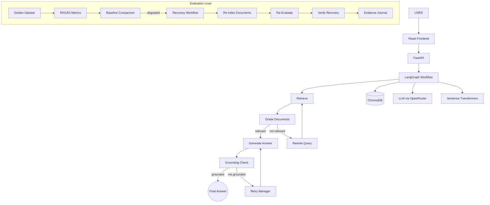

# 🛡️ HealRAG — Self-Healing RAG System

HealRAG is a **production-style Retrieval-Augmented Generation (RAG) system** that goes beyond answering questions — it **detects failures, heals itself, and verifies its own recovery**.

---

## 🤔 Why Normal RAG Is Not Enough

Standard RAG pipelines are fragile:

| Problem | Impact |
|---|---|
| Poor retrieval | Wrong or irrelevant context fed to the LLM |
| Hallucination | LLM invents facts not in the documents |
| Index drift | ChromaDB degrades over time |
| No quality monitoring | No way to detect when the system silently fails |

HealRAG fixes all of this with self-correction loops at every step.

---

## 🏗️ Architecture



---

## 📁 Project Structure

```
HealRAG/
├── app.py                    # CLI entry point
├── config.py                 # Centralized settings (Pydantic)
├── requirements.txt
├── .env.example
├── Dockerfile
├── docker-compose.yml
│
├── data/
│   ├── documents/            # Drop your PDF/TXT/MD files here
│   └── golden/
│       ├── golden_dataset.json
│       └── baseline.json     # Created on first evaluation
│
├── ingestion/
│   ├── loader.py             # PDF, TXT, Markdown loader
│   ├── splitter.py           # RecursiveCharacterTextSplitter
│   └── indexer.py            # Full ingestion workflow
│
├── embeddings/
│   └── embedder.py           # HuggingFace or OpenAI embeddings factory
│
├── vectorstore/
│   └── chroma_store.py       # ChromaDB CRUD and singleton
│
├── retrieval/
│   ├── retriever.py          # Similarity search retriever
│   ├── relevance_grader.py   # LLM-based relevance grader
│   └── query_rewriter.py     # Query optimizer for poor retrieval
│
├── generation/
│   ├── generator.py          # LLM answer generator
│   └── prompts.py            # All system prompts (separate from logic)
│
├── healing/
│   ├── hallucination_checker.py  # Grounding verification
│   ├── retry_manager.py          # Bounded retry manager (MAX_RETRIES)
│   └── recovery.py               # System-level recovery workflows
│
├── graph/
│   ├── state.py              # TypedDict LangGraph state
│   └── workflow.py           # Full LangGraph pipeline + nodes + edges
│
├── evaluation/
│   ├── ragas_evaluator.py    # RAGAS quality evaluation
│   ├── baseline.py           # Baseline creation and loading
│   └── regression.py        # Regression detection with tolerance
│
├── health/
│   └── health_checker.py     # Multi-component health diagnostics
│
├── evidence/
│   ├── evidence_logger.py    # JSONL healing event logger
│   └── journal.jsonl         # Persistent healing evidence journal
│
├── api/
│   └── main.py               # FastAPI with all endpoints
│
├── dashboard/
│   └── app.py                # HTML dashboard (port 8501)
│
├── frontend/                 # React + Vite UI (port 3000)
│   ├── src/
│   │   ├── App.jsx
│   │   ├── api.js
│   │   └── components/
│   │       ├── Chat.jsx
│   │       ├── Health.jsx
│   │       ├── Evaluation.jsx
│   │       └── Evidence.jsx
│   └── Dockerfile
│
└── tests/
    ├── test_ingestion.py
    ├── test_retrieval.py
    ├── test_generation.py
    ├── test_healing.py
    ├── test_evaluation.py
    └── test_health.py
```

---

## ⚙️ Setup

### 1. Clone & Install

```bash
git clone https://github.com/Mansi091/HealRAG.git
cd HealRAG
pip install -r requirements.txt
```

### 2. Configure Environment

```bash
cp .env.example .env
```

Edit `.env`:

```env
OPENROUTER_API_KEY=your_openrouter_key_here
OPENROUTER_MODEL=openai/gpt-4o-mini
EMBEDDING_MODEL=sentence-transformers/all-MiniLM-L6-v2
CHROMA_PERSIST_DIR=./data/chroma
TOP_K=4
MAX_RETRIES=2
RELEVANCE_THRESHOLD=0.5
GROUNDING_THRESHOLD=0.7
RAGAS_THRESHOLD=0.7
```

---

## 📥 Document Ingestion

Drop your `.pdf`, `.txt`, or `.md` files into `data/documents/` then:

```bash
python app.py --ingest
```

Or via API:

```bash
curl -X POST http://localhost:8000/ingest
```

---

## 🚀 Running the API

```bash
python app.py --server
# or directly:
uvicorn api.main:app --host 0.0.0.0 --port 8000 --reload
```

API docs: http://localhost:8000/docs

---

## 💬 Running the Frontend

```bash
cd frontend
npm install
npm run dev
# Opens at http://localhost:3000
```

---

## 📊 Running Evaluation

```bash
python app.py --evaluate
# or via API:
curl -X POST http://localhost:8000/evaluate
```

---

## 📏 Creating a Baseline

```bash
curl -X POST http://localhost:8000/baseline
# To force-update an existing baseline:
curl -X POST http://localhost:8000/baseline -H "Content-Type: application/json" -d '{"force_overwrite": true}'
```

---

## 🔧 Triggering Recovery

```bash
curl -X POST http://localhost:8000/recover
```

This will:
1. Diagnose the degradation
2. Execute recovery (re-index or reset vectorstore)
3. Re-run evaluation
4. Verify if health was restored

---

## 🧪 Running Tests

```bash
pytest tests/ -v
```

> Tests mock LLM API calls — no paid API usage needed.

---

## 🐳 Running with Docker

```bash
docker compose up --build
```

| Service | Port |
|---|---|
| FastAPI | http://localhost:8000 |
| Dashboard | http://localhost:8501 |
| React UI | http://localhost:3000 |

---

## 📡 Example API Requests

### Ask a question
```bash
curl -X POST http://localhost:8000/query \
  -H "Content-Type: application/json" \
  -d '{"question": "What failure modes affect RAG systems?"}'
```

### Response example
```json
{
  "question": "What failure modes affect RAG systems?",
  "answer": "Standard RAG systems suffer from poor retrieval, hallucination...",
  "sources": [{"source": "sample_ai_overview.txt", "page": 1}],
  "retrieval": {"relevance_score": 0.87, "relevant": true},
  "grounding": {"score": 0.91, "grounded": true},
  "healing": {"triggered": false, "actions": [], "retry_count": 0},
  "status": "success"
}
```

---

## 🔄 Self-Healing Workflow Example

```
User question → Retrieve documents
                     ↓
            Grade document relevance
                     ↓
         [Score < threshold = 0.5]
                     ↓
            Rewrite query → Retrieve again
                     ↓
            Generate answer with LLM
                     ↓
           Check grounding against context
                     ↓
         [Score < threshold = 0.7]
                     ↓
          Retry (bounded by MAX_RETRIES=2)
                     ↓
          Log healing action to journal.jsonl
                     ↓
               Return final answer
```

---

## 🌡️ Environment Variables

| Variable | Default | Description |
|---|---|---|
| `OPENROUTER_API_KEY` | — | OpenRouter API key |
| `OPENROUTER_MODEL` | `openai/gpt-4o-mini` | LLM model name |
| `EMBEDDING_MODEL` | `sentence-transformers/all-MiniLM-L6-v2` | Embedding model |
| `CHROMA_PERSIST_DIR` | `./data/chroma` | ChromaDB storage directory |
| `TOP_K` | `4` | Number of retrieved documents |
| `CHUNK_SIZE` | `1000` | Document chunk size |
| `CHUNK_OVERLAP` | `200` | Chunk overlap |
| `MAX_RETRIES` | `2` | Max self-healing retries |
| `RELEVANCE_THRESHOLD` | `0.5` | Min relevance score |
| `GROUNDING_THRESHOLD` | `0.7` | Min grounding score |
| `RAGAS_THRESHOLD` | `0.7` | Min RAGAS quality score |

---

## 📐 Core Architecture Principle

HealRAG does NOT simply do:
```
Question → Retrieval → LLM → Answer
```

It does:
```
Question → Retrieve → Grade → Fix if needed → Generate →
Verify grounding → Fix if needed → Return answer → Log what happened

At system level:
Evaluate → Detect degradation → Recover → Re-evaluate → Verify recovery
```

That self-correction and verification loop is the core identity of HealRAG.
